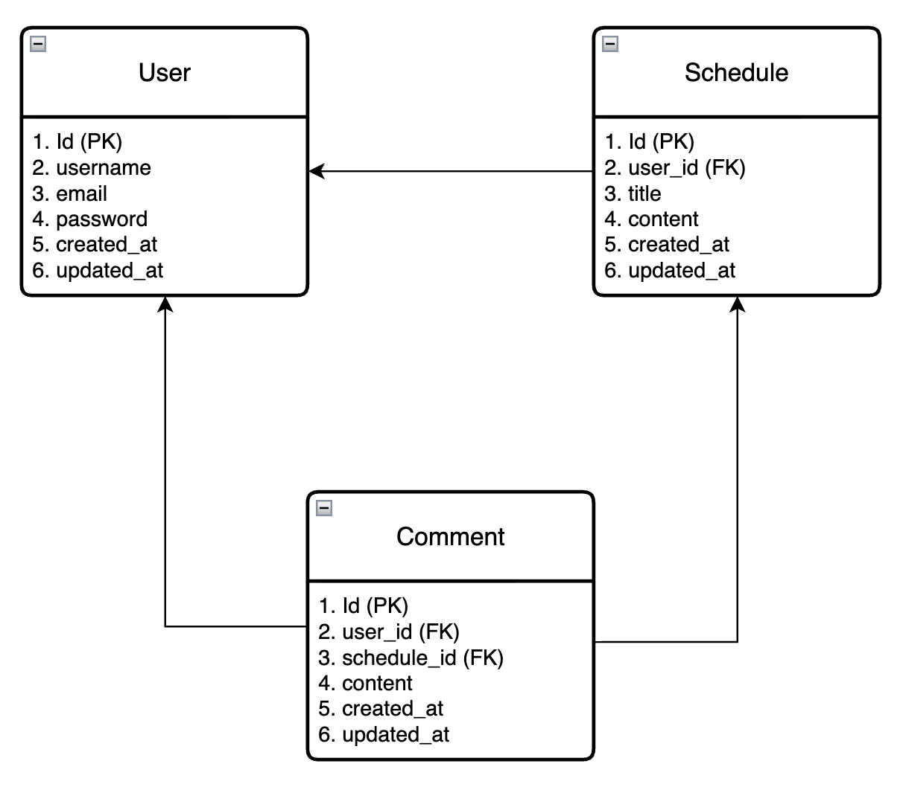

# CH.3 숙련 Spring 일정 관리 앱

## API 명세서

| 기능 | Method | URL | request | response | 상태코드 |
|---|---|---|---|---|---|
| 회원가입 | POST | /users | 요청 body | 등록 정보 | 201 Created, 400 Bad Request |
| 로그인 | POST | /users/login | 요청 body | 로그인 성공! | 200 OK, 400 Bad Request, 401 Unauthorized |
| 로그아웃 | POST | /users/logout | - | 로그아웃 성공! | 200 OK |
| 유저 전체 조회 | GET | /users | - | 다건 응답 정보 | 200 OK |
| 유저 단건 조회 | GET | /users/{id} | 요청 param | 단건 응답 정보 | 200 OK, 404 Not Found |
| 유저 수정 | PUT | /users/{id} | 요청 body | 수정 정보 | 200 OK, 400 Bad Request, 401 Unauthorized, 403 Forbidden, 404 Not Found |
| 유저 삭제 | DELETE | /users/{id} | 요청 param | - | 204 No Content, 401 Unauthorized, 403 Forbidden, 404 Not Found |
| 일정 생성 | POST | /schedules | 요청 body | 등록 정보 | 201 Created, 400 Bad Request, 401 Unauthorized |
| 일정 전체 조회 | GET | /schedules | - | 다건 응답 정보 | 200 OK |
| 일정 단건 조회 | GET | /schedules/{id} | 요청 param | 단건 응답 정보 | 200 OK, 404 Not Found |
| 일정 수정 | PUT | /schedules/{id} | 요청 body | 수정 정보 | 200 OK, 400 Bad Request, 401 Unauthorized, 404 Not Found |
| 일정 삭제 | DELETE | /schedules/{id} | 요청 param | - | 204 No Content, 401 Unauthorized, 404 Not Found |

## 주요 API

### 회원가입
Request Body
```json
{
  "name": "정예진",
  "email": "yejin@example.com",
  "password": "12345678"
}
```
Response
```json
{
  "id": 1,
  "name": "정예진",
  "email": "yejin@example.com",
  "createdAt": "2026-04-16T20:00:00"
}
```
### 로그인
Request Body
```json
{
  "email": "yejin@example.com",
  "password": "12345678"
}
```
Response
```json
{
  "message": "로그인 성공!"
}
```
### 일정 생성
Request Body
```json
{
  "title": "과제 제출",
  "content": "스프링 과제 제출하기",
  "userId" : 1
}
```
Response
```json
{
  "id": 1,
  "title": "과제 제출",
  "content": "스프링 과제 제출하기",
  "userId": 1,
  "createdAt": "2026-04-16T22:00:00"
}
```
### 일정 수정
Request Body
```json
{
  "title": "과제 제출 수정",
  "content": "스프링 과제 다시 제출하기"
}
```
Response
```json
{
  "id": 1,
  "title": "과제 제출 수정",
  "content": "스프링 과제 다시 제출하기",
  "userId": 1,
  "updatedAt": "2026-04-16T23:30:00"
}
```

## ERD



## Lv 1. 일정 CRUD

- 일정을 생성, 전체 조회, 단건 조회, 수정, 삭제할 수 있도록 구현했습니다.
- 일정은 작성 유저명, 할일 제목, 할일 내용, 작성일, 수정일 필드를 가지도록 구성했습니다.
- `createdAt`, `updatedAt`은 JPA Auditing을 사용했습니다.

## Lv 2. 유저 CRUD

- 유저를 생성, 전체 조회, 단건 조회, 수정, 삭제할 수 있도록 구현했습니다.
- 유저는 유저명, 이메일, 작성일, 수정일 필드를 가지도록 구성했습니다.
- `createdAt`, `updatedAt`은 JPA Auditing을 사용했습니다.
- 일정은 작성 유저명 대신 유저 고유 식별자를 가지도록 연관관계를 반영했습니다.

## Lv 3. 회원가입
- 유저 엔티티에 비밀번호 필드를 추가했습니다.
- 비밀번호는 8글자 이상 입력하도록 구성했습니다.
- 회원가입 시 유저명, 이메일, 비밀번호를 함께 저장할 수 있도록 구현했습니다.

## Lv 4. 로그인
- 이메일과 비밀번호를 입력받아 로그인 기능을 구현했습니다.
- 로그인 성공 시 `HttpSession`에 로그인 사용자 정보를 저장하도록 구현했습니다.
- 로그인 이후 일정 생성, 수정, 삭제 API에서 세션을 확인하여 인증된 사용자만 접근할 수 있도록 처리했습니다.
- 로그인 성공 시 서버는 `JSESSIONID`를 발급하며, 이를 통해 세션 기반 인증이 유지됩니다.

## Lv 5. 다양한 예외처리
- `Validation`을 활용해 요청값에 대한 예외처리를 적용했습니다.
- `@RestControllerAdvice`를 사용해 validation 예외가 발생했을 때 클라이언트에게 에러 메시지를 전달하도록 구성했습니다.
- 각 필드별 입력 조건을 설정했습니다.

## Lv 6. 비밀번호 암호화
- Lv.3에서 사용한 비밀번호 필드에 암호화를 적용했습니다.
- `PasswordEncoder`를 직접 생성하여 비밀번호를 암호화하도록 구성했습니다.
- 회원가입 및 저장 시 입력한 비밀번호는 BCrypt 기반 암호화 문자열로 변환한 뒤 저장되도록 구현했습니다.
- 비밀번호 검증이 필요한 경우에는 입력값과 암호화된 비밀번호를 `matches()`로 비교하도록 적용했습니다.

## Lv 7. 댓글 생성 및 조회
- 생성한 일정에 댓글을 작성할 수 있도록 구현했습니다.
- 댓글과 일정은 연관관계를 가지도록 매핑했습니다.
- 댓글 저장 및 전체 조회 기능을 구현했습니다.
- `createdAt`, `updatedAt`은 JPA Auditing을 사용했습니다.

## Lv 8. 일정 페이징 조회
- 일정 전체 조회에 페이징 기능을 적용했습니다.
- `Pageable`과 `PageRequest`를 사용해 페이지 번호와 페이지 크기를 기준으로 조회할 수 있도록 구현했습니다.
- 일정은 `updatedAt` 기준 내림차순으로 정렬되도록 구성했습니다.
- 조회 결과는 `Page<SchedulePageResponseDto>` 형태로 반환되도록 구현했습니다.